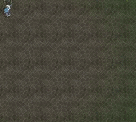

## 字符画(无聊)



字符画原理:通过像素的灰度来映射出ASCII字符. 灰度值越大，所映射的ASCII字符占的单位面积越大，看起来越黑.
（例如某点的灰度是0，对应的字符是空格；灰度为255时，对应的字符是“$”）
实际操作时将图片分隔成一个个小矩形来处理.

我这里只需要将汉字转成字符画,所以用的是点阵字库.(网上也有很多文字转字符画的软件)

将输出的字符画处理好之后(具体怎么处理看自己,我这里就处理成了一个字符串放在下面的表里),剩下的就交给LUA跑了

```lua
--这表里一行就是一个字
local phrase = {
        "OOOOOOOXOOOEOOOXXXXXXXXEXXXOOOOOOOOEXOXOXXXXXXOEXOXOXOOOOXOEXOXOXXXXXXOEXOXOOOOOOOOEXOXOXXXXXXOEXXXOOOOOXOOEXOXOOOOXOOOEOOOOOOOXOOOEOOOOOOXXOOOE", 
        "OOOOOOOXOOOEOOOXXXXXXXXEXXXOOOOOOOOEXOXOXXXXXXOEXOXOXOOOOXOEXOXOXXXXXXOEXOXOOOOOOOOEXOXOXXXXXXOEXXXOOOOOXOOEXOXOOOOXOOOEOOOOOOOXOOOEOOOOOOXXOOOE", 
        "OOOOOOOOOOOEOOOOOOOOOOOEOOOOOOOOOOOEOOOOOXXOXOOEOOOOXOOXOOOEOOOOOOOOOOOEOOOOOOOOOOOEOOOOOOOOOOOE", 
        "OOOOXXXXXXXEXXXOXOOXOOXEXOXOXXXXXXXEXOXOXOOXOOXEXOXOXOXOXOXEXOXOXXOOOXXEXOXOXXXXXXXEXOXOOOXOOOOEXXXOXOOXOXOEXOXOXOXOOOXEOOOXOOXOXOXEOOOOOOOXXOOE", 
        "OOOOOOOOOOOEOOOOOOOOOOOEOOOOOOOOOOOEOOOOOXXOXOOEOOOOXOOXOOOEOOOOOOOOOOOEOOOOOOOOOOOEOOOOOOOOOOOE", 
        "XXXOXXXOXXXEXOXOXOXOOXOEXOXOXOXXXXOEXOXOXXOXOXOEXOXOXXOXOXOEXOXOXOXXOXOEXOXOXOXXXXOEXXXOXOXOOXOEXOXOXXOOOXOEOOOOXOOOOXOEOOOOXOOOXXOE", 
        "XXXOXXXOXXXEXOXOXOXOOXOEXOXOXOXXXXOEXOXOXXOXOXOEXOXOXXOXOXOEXOXOXOXXOXOEXOXOXOXXXXOEXXXOXOXOOXOEXOXOXXOOOXOEOOOOXOOOOXOEOOOOXOOOXXOE", 
        "XXXOXXXOXXXEXOXOXOXOOXOEXOXOXOXXXXOEXOXOXXOXOXOEXOXOXXOXOXOEXOXOXOXXOXOEXOXOXOXXXXOEXXXOXOXOOXOEXOXOXXOOOXOEOOOOXOOOOXOEOOOOXOOOXXOE", 
        "XXXOXXXOXXXEXOXOXOXOOXOEXOXOXOXXXXOEXOXOXXOXOXOEXOXOXXOXOXOEXOXOXOXXOXOEXOXOXOXXXXOEXXXOXOXOOXOEXOXOXXOOOXOEOOOOXOOOOXOEOOOOXOOOXXOE", 

    }

local function display_str(refer,paint,display_prefab,vanish_time)
                        --(参照物,字符表,用于展示的预制物,消散时间(不填则不消散))
    --东北朝上,字符生成在人物的右下方
    local target_str = "X" --要查找的字符
    local crlf_str = "E" --换行
    local pos = Vector3(refer.Transform:GetWorldPosition()) --参照物的坐标
    local str_offsetpos = Vector3(-2,0,-2) --偏移量
    local abs_pos = pos - str_offsetpos

    local len_h = 0
    local len_w = 0 
    for k=1,string.len(paint) do
        if string.sub(paint,k,k) == crlf_str then
            len_h = len_h + 1
            if len_h == 1 then
                len_w = string.len(string.sub(paint,1,k))
            end
        end
    end
    print(len_h,len_w)

    local pieces_sav = {}
    for k=1,len_h do
        --refer:DoTaskInTime(k,function()
        for i= len_w*(k-1), len_w*k do
            if string.sub(paint,i,i) == target_str then
                local fact_pos = abs_pos + Vector3(k,0,i-len_w*(k-1)) --实际坐标
                SpawnPrefab("sand_puff").Transform:SetPosition(fact_pos:Get())
                table.insert(pieces_sav,SpawnPrefab(display_prefab))
                pieces_sav[#pieces_sav].Transform:SetPosition(fact_pos:Get())
            end
        end
        --end)
    end
    if vanish_time ~= nil then
        refer:DoTaskInTime(vanish_time,function()
            for k=1,#pieces_sav do
                pieces_sav[k]:Remove()
            end
        end)
    end
end

--运行
for k=1,#phrase do
    inst:DoTaskInTime(k,function()
        display_str(inst,phrase[k],"goldnugget",1)
    end)
end
```

好吧我是有点无聊弄这个的,不过也有些其他用途,比如一键生成预设好的布局的围墙,当做一些比较麻烦的装置时,也许会用到(