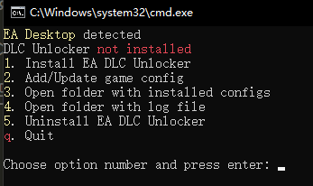
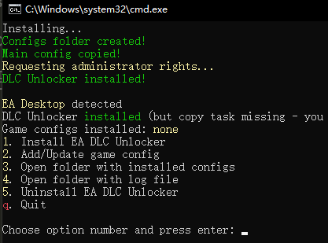
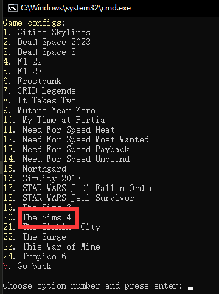
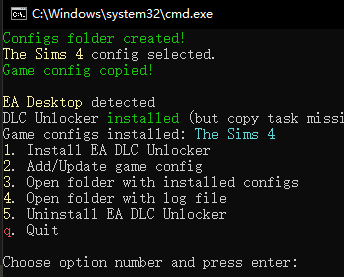
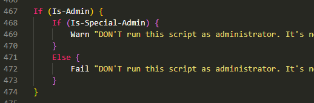
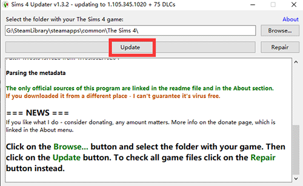
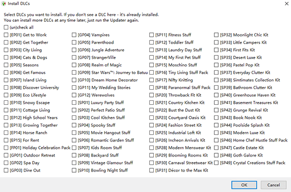

## The Sim 4 DLC 解锁和下载

>1.<i style="color:aqua;">从```steam```下载本体</i>

>2.<i style="color:aqua;">用```EA DLC UNLOCKER V2```解锁DLC</i>

>3.<i style="color:aqua;">用```sims-4-updater```下载DLC</i>

***
```EA DLC UNLOCKER V2```:
源下载地址:[https://rentry.co/ea-dlc-unlockers#ea-dlc-unlocker-v2](https://rentry.co/ea-dlc-unlockers#ea-dlc-unlocker-v2)

```sims-4-updater```
源下载地址:[https://krakenfiles.com/view/ZU0oqvyEKn/file.html](https://krakenfiles.com/view/ZU0oqvyEKn/file.html)

如果游戏更新,也需要同步更新这两个工具(```EA DLC UNLOCKER V2```需要更新;```sims-4-updater```有自动更新功能,所以正常情况不用重下)

以上两个文件需要魔法才能下载.
这里给大家放到github上了(无需魔法,但如果下载很慢,请使用魔法或steam++这类工具加速github):
```EA DLC UNLOCKER V2```:
github:[https://github.com/b1inkie/b1note.github.io/releases/download/TheSim4/sims-4-updater-v1.3.2.7z](https://github.com/b1inkie/b1note.github.io/releases/download/TheSim4/sims-4-updater-v1.3.2.7z)

```sims-4-updater```:
github:[https://krakenfiles.com/view/ZU0oqvyEKn/file.html](https://krakenfiles.com/view/ZU0oqvyEKn/file.html)

***

<i style="color:crimson;">以上准备完成后,请确保接下来的操作中不要出现任何中文字符</i>

### 第一步跳过(下载游戏后请打开一次游戏并退出)


### 第二步

下载```EA DLC UNLOCKER V2```,解压到任意目录,运行```setup.bat```

输入 1 回车

输入 2 回车

找到```the sim 4```的对应编号,输入20回车

至此DLC解锁完毕,叉掉窗口.

>**<i style="color:crimson;">出现报红问题:</i>**

>1.出现```管理员权限运行```英文字样:
请右键```setup.bat```选择```以管理员身份运行```或不用管理员身份都试一次
如果都失败,请右键编辑```setup.bat```文件,将以下这段删除:

删除后请以管理员或不以管理员身份都试一次,
如果还是失败,请检查是否登录的是管理员账户,切换到非管理员账户即可

>2.出现```文件缺失或被杀毒软件拦截```英文字样:
请检查解压过程有没有提前结束导致解压不完整,或检查系统是否隔离了部分文件

### 第三步 

将```sims-4-updater```解压到游戏根目录,运行```sims-4-updater-v1.3.2.exe```
等待读条结束,点击```update```,选是

勾选需要的DLC,等待下载完成即可

    
