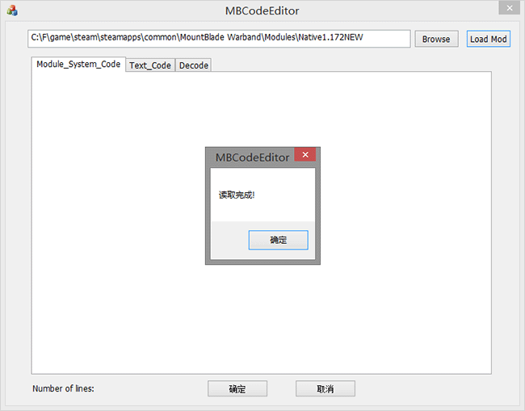
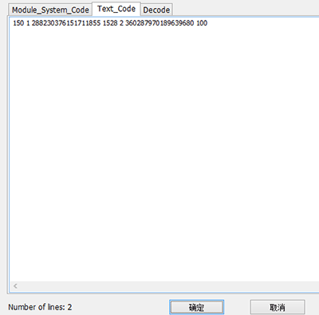

## 简单引导

先看下面两个问题:

><i style="color:aqua;">Q:没学过PYTHON也可以自己写代码吗？</i>
>A:完全可以，骑砍用的是ms，即使你会python也是要再学的。
><i style="color:aqua;">Q:没有任何代码基础也可以自己写吗？</i>
>A：可以，但可能需要一点英文基础，否则可能有一点吃力。

正篇：

我们先看看MOD根目录里有哪些东西（只取部分）：

| 文件 | 描述 |
| ---- | ---- |
| 文件夹languages | 简中在里面的cns里 |
| 文件夹Resource | 模型 |
| 文件夹SceneObj | 场景 |
| 文件夹Textures | 材质图片 |
| conversation.txt | 对话 |
| factions.txt | 阵营 |
| item_kinds1.txt | 物品 |
| menus.txt | 菜单 |
| mission_templates.txt | 战场相关 |
| party_templates.txt | 部队模板 |
| troops.txt | 兵种 |
| quests.txt | 任务 |
| quick_strings.txt | 快速字符串？ |
| strings.txt | 字符串 |
| scripts.txt | 脚本 |
| variables.txt | 全局变量 |
| triggers.txt | 触发器 |
| simple_triggers.txt | 简单触发器 |

只列了一部分，有些我们基本用不上的，或者说新人不会第一时间接触的就没有写上去了。

光是上面一个表肯定还是有些迷惑，我们先来简单说下代码怎么写，再说写好的代码往哪放。

骑砍里面每句代码都有编号，所以又叫操作号或者操作码，这就是OPCODE.
已经有前辈帮我们汉化好了一份OPCODE（但是不全），大家可以 [点此下载](https://github.com/b1inkie/b1inkie.github.io/releases/download/untagged-1e6a4a47c9e8df84dcc6/OPCODE-CHS.txt)
还有一份原版的OPCODE，也建议一并下载。[点此下载](https://github.com/b1inkie/b1inkie.github.io/releases/download/untagged-1f8c8e6671bcc52a1f87/OPCODE-EN.txt)
汉化的那版里查不到的可以去原版查。

打开之后，就非常清晰的看到每个代码是干什么的了。
我们举个例子：
```python
###troop添加钱
troop_add_gold  = 1528 # (troop_add_gold,<troop_id>,<value>),
```
那么我们想给玩家加100第纳尔就可以这样写：
```python
(troop_add_gold,"trp_player",100),
```
但我们在哪里给玩家加第纳尔呢，总得有个触发条件吧，就比如说当玩家背包里有风干肉itm_dried_meat的时候，就给玩家加100第纳尔，那我们可以这样写：
```python
(player_has_item,"itm_dried_meat"),
(troop_add_gold,"trp_player",100),
```
源码写完了之后，我们需要把它编译成TXT，这时就需要用到MBCodeEditor，大家可以[点此下载](https://github.com/b1inkie/b1inkie.github.io/releases/download/1.0.0/MBCodeEditor.7z)
打开MBCE，我们做个简单引导。



把MOD路径拷贝到地址栏，点一下LOAD MOD，提示读取成功就ok了，如果MBCE都读不出来，那你只能找作者要源码了。
好，现在我们把写好的代码丢进Module_System_Code里面，再点一下Text_Code，便编译好了



最下面的Numbers of lines:2 表示代码一共有两行。
好了，现在我们把它放进简单触发器simple_triggers里面↓
打开simple_triggers，第二行的数字代表触发器的总数量，我们加一个这里就要加1。
在最下面一行加上我们编译好的代码：

<i style="color:red;">24.000000</i> <i style="color:yellow;">2</i> <i style="color:aqua;">150 1 288230376151711855 1528 2 360287970189639680 100</i>

24代表每24小时检测一次，2代表代码总行数是2行，后面则是我们编译好的TXT了。
那么游戏运行中每24小时就会检测一次玩家背包有没有风干肉，有的话就加100第纳尔给玩家。

我们在刚接触MS的时候，就可以先写几个simple_trigger练练手。
如果你想交互性更强，可以写写对话conversation，具体可以看[conversation教程](https://b1inkie.github.io/subpage/MB/txt/ex-002.html)

那么简单引导就到这里了。一个完整的MOD还需要很多部分一起组成，请自行探索啦~

