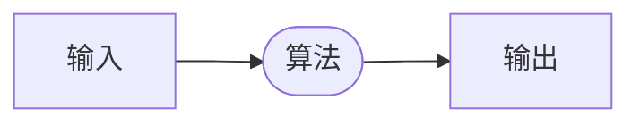

>*24.05.25*

## 概念
- 算法的概念：解决问题的方法

```mermaid
graph LR
    direction LR
    输入 --> _([算法]) --> 输出
```

- 大家平时写程序解决的一些问题,这个解决问题的过程就可以叫做算法.例如: 大家写ms时,遇到的一些问题,像获取离玩家最近的敌人;免疫远程伤害等.(但这些问题的解决办法是针对某一个问题的,换句话说,这个方法没有复用性,而我们算法可以用来解决某一类问题)

