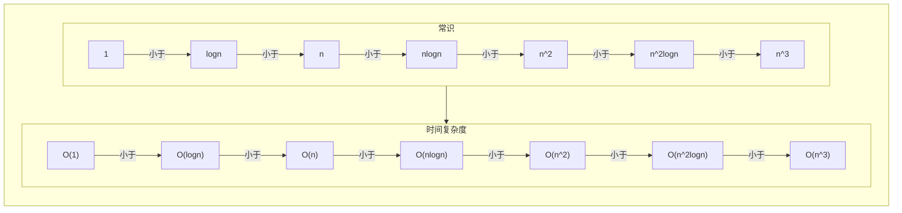
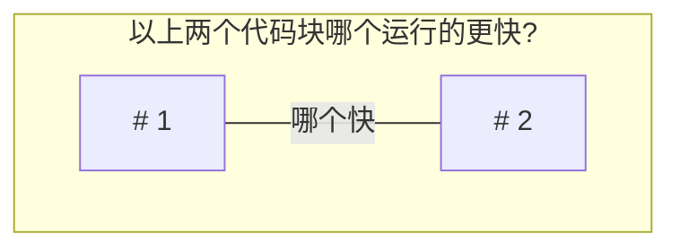
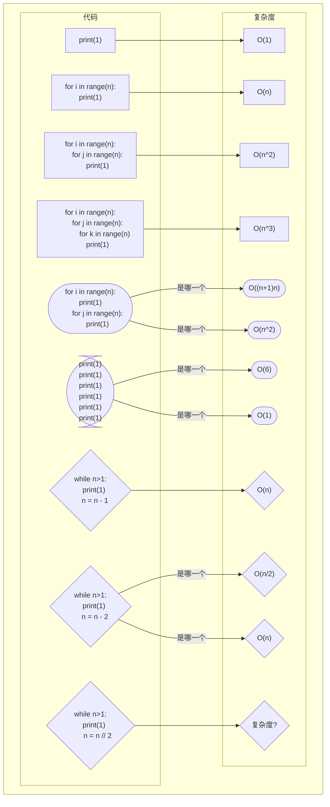
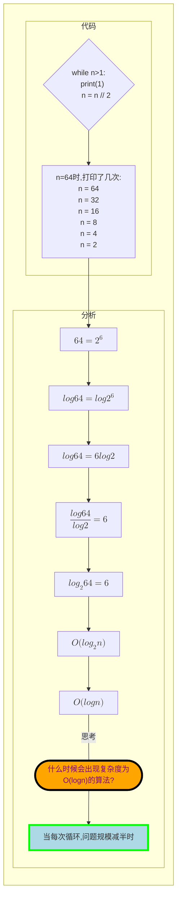

### 1. 时间复杂度(抛出一个概念)

- 时间复杂度的表示方法: `O(复杂度)`
- 常见的时间复杂度: `O(1)<O(logn)<O(n)<O(nlogn)<O(n^2)<O(n^2logn)<O(n^3)`


***
```python
# 1
for i in range(n):
    print(1)
```

```python
# 2
for j in range(n):
    for i in range(n):
        print(1)
```            

***

***


***


