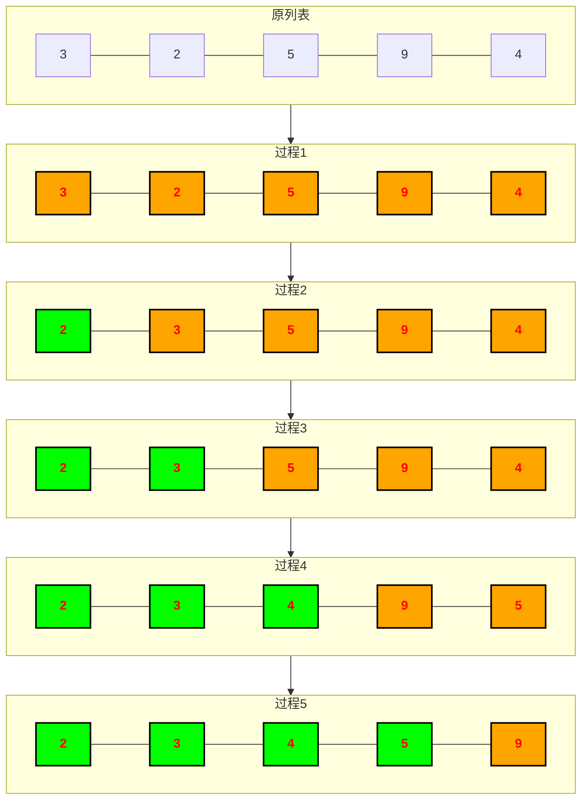

## 简述

每次遍历找到最小的一个数,循环往复即可得到一个排好序的列表

## 思考

1. 每次遍历后找到的最小的数,放在哪儿?
- 建新列表会多消耗一份内存

2. 每次遍历后为了找到最小的数,原列表是不是还要删掉每次找到的数?
- 删除元素是不是也有时间复杂度

3. 怎样去找最小的数?
- 内置函数min?


## 图解



## 排序过程简述:

走一趟无序区找出最小的数放到无序区第一个位置,无序区减少一个数

## 代码实现:
```python
def selection_sort(lst):
    for i in range(len(lst)-1):
        min_index = i # 假设无序区的第一个元素为最小值
        for j in range(i+1, len(lst)): # 遍历无序区
            if lst[j] < lst[min_index]: # 假如有更小的值
                min_index = j # 更新最小值索引
        lst[i], lst[min_index] = lst[min_index], lst[i] # 交换最小值

```

## 时间复杂度:

$$O(n^2)$$